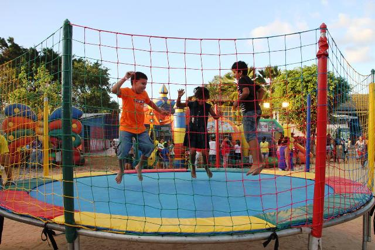
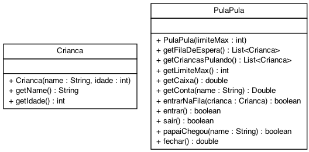

# Pula-Pula no parquinho


Nosso objetivo no trabalho é modelar um gestor de pula pulas em um parquinho.

- [Requisitos](#requisitos)
- [Dicas](#requitos)
- [Diagrama](#diagrama)
- [Exemplo de execução](#exemplo-de-execução)
- [Relatório de Entrega](#relatório-de-entrega)


## Requisitos

- Limite Máximo
  - Deve ser possível definir no construtor o máximo de crianças que cabe no pula-pula.
- Entrar na fila
  - Insere crianças na fila de espera.
  - Não é possível inserir duas ou mais crianças com o mesmo nome na fila de espera.
  - Obrigatoriamente quando uma criança entrar na fila, ela tem que ir para o final da fila.
- Entrar no pula-pula.
  - Mover a primeira criança da fila de espera do pula-pula para dentro do pula-pula.
- Sair do pula-pula.
  - Mover a primeira criança que entrou no pula-pula para o final da fila de espera.
- Papai Chegou
  - O pai da criança chegou, então ele busca a criança naa fila de espera ou no pula-pula, retira do brinquedo e depois disso paga a conta da criança
- Fechar
  - Retira todas as crianças do pula-pula e da fila e receba o dinherio daquelas que brincaram no pula-pula.
- Pagar
  - Quando o pai de alguma criança chegar ou o pula-pula fechar, a(s) conta(s) da(s) deve/devem ser paga(s).

## Diagrama



## Exemplo de execução 
```java

public class Runner {
    
    public static void main(String[] args) {

        //Inicializando o pula-pula 
        PulaPula pulaPula =  new PulaPula(5);
        System.out.println(pulaPula);
        /*
            Caixa: R$ 0.0 Limite: 0/5
            [] <== [] <==
        */

        //Entrando na fila de espera
        pulaPula.entrarNaFila(new Crianca("mario", 5));
        pulaPula.entrarNaFila(new Crianca("ana", 4));
        pulaPula.entrarNaFila(new Crianca("diego", 3));
        System.out.println(pulaPula);
        /*
            Caixa: R$ 0.0 Limite: 0/5
            [] <== [mario:5, ana:4, diego:3] <==
        */

        //Entrando no pula-pula
        pulaPula.entrar();
        pulaPula.entrar();
        System.out.println(pulaPula);
        /*
            Caixa: R$ 0.0 Limite: 2/5
            [mario:5, ana:4] <== [diego:3] <==
        */

        //Saindo e entrando novamente no pula-pula  
        pulaPula.sair();
        pulaPula.entrar();
        pulaPula.entrar();
        System.out.println(pulaPula);
        /*
            Caixa: R$ 0.0 Limite: 3/5
            [ana:4, diego:3, mario:5] <== [] <==
        */

        //Papai chegou e pagou a conta
        pulaPula.papaiChegou("mario");
        pulaPula.sair();
        System.out.println(pulaPula);
        /*
            Caixa: R$ 5.0 Limite: 1/5
            [diego:3] <== [ana:4] <==
        */
        if(pulaPula.papaiChegou("pedro") == false){
            System.out.println("fail: não há nenhuma criança com esse nome na fila ou pula-pula"); 
        }   //fail: não há nenhuma criança com esse nome na fila ou pula-pula

        pulaPula.papaiChegou("ana");
        System.out.println(pulaPula);
        /*
            Caixa: R$ 7.5 Limite: 1/5
            [diego:3] <== [] <==
        */
        
        //Fechar o pula-pula  
        pulaPula.entrarNaFila(new Crianca("luiza", 8));
        pulaPula.sair();
        pulaPula.entrar();
        System.out.println(pulaPula);
        /*
            Caixa: R$ 7.5 Limite: 1/5
            [luiza:8] <== [diego:3] <==
        */
        System.out.println(pulaPula.fechar()); //12.5
        System.out.println(pulaPula);
        /*
            Caixa: R$ 12.5 Limite: 0/5
            [] <== [] <==
        */
    }
}
```

## Relatório de Entrega

Não esqueça de preencher o seguinte formulário [Link para formulário](https://forms.gle/ti6HxcPJHWc3Lwsa7) ao completar a atividade.
